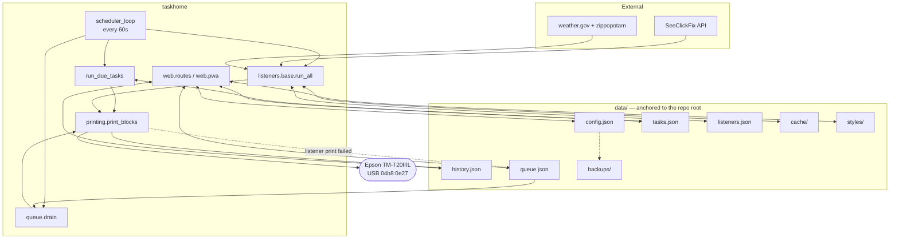

# Architecture Overview

## Shape

`app.py` is a 20-line entry point. The application is the `taskhome` package,
assembled by an app factory:

```python
create_app(load=True, with_scheduler=False)
```

**Importing the package has no side effects.** No data is read, no thread is
started, no printer is opened. That is deliberate and load-bearing: before the
package split, `import app` started a scheduler, which meant a maintenance
script or a stray test could fire real receipts against live data. Two scripts
did exactly that.

`start_scheduler()` refuses to start a second thread in the same process, so a
double `create_app(with_scheduler=True)` cannot produce duplicate prints.

Serving is via Flask's built-in server — no WSGI server, no workers, no
reloader.

## Modules

See `taskhome/README.md` for the full table. The layering:

```
constants ──► state ──► storage ──► everything else
                 │
                 ├── recurrence ──┐
                 ├── receipt ─────┤
                 ├── layouts ─────┼──► printing ──► queue
                 ├── styles ──────┘        │
                 │                          ▼
                 ├── listeners/base ──► listeners/{scf,nws}
                 │                          │
                 └── web/{routes,pwa} ◄─────┘
                            ▲
                       scheduler
```

`state.py` holds the only mutable globals — `config`, `tasks`, `history`,
`listeners`, `STATE_LOCK`, `load_failed`. **Cross-module access goes through
the module object** (`state.tasks`), never `from .state import tasks`:
rebinding a name imported the second way is invisible to every other module.

## Data flow



## The scheduler tick

One daemon thread. `run_catchup(datetime.now())` runs once at startup under the
configured policy, then every 60 seconds:

1. **`queue.drain()`** — first, so a backlog clears in order before more is
   added to it. Draining last would print a long outage newest-first.
2. **`run_due_tasks(now)`** — fire anything due.
3. **`scf.poll_scf_listener(now_utc)`** — the bespoke SeeClickFix listener.
4. **`listener_base.run_all(now_utc)`** — every listener on the plugin
   interface.

Each task has its own `try`, so one malformed task cannot stall the rest of the
tick (`P0-6`). `run_all` isolates each listener for the same reason.

Times are **naive local wall-clock** in steps 1–2 and **aware UTC** in 3–4.
That is not an inconsistency: a chore reminder is a wall-clock time and a
listener watermark is an instant. See [scheduling.md](scheduling.md).

## Failure handling

The through-line: **paper is irreversible**, so every path has to decide
whether its failure mode is "print twice" or "never print", and neither is
acceptable silently.

- **A print returns whether paper came out.** The scheduler advances a schedule
  only on `True` (`P0-4`); a listener marks an item seen only once handled; the
  test-print routes report the real outcome (`P0-10`).
- **A failed *listener* print is queued.** Its polling window has already moved
  past the item, so without the queue it is simply gone.
- **A failed *task* print is not queued.** The task staying due is already a
  durable retry — `next_time` is untouched and persisted. Doing both gave one
  occurrence two retry mechanisms, and when the printer came back the queue
  drained the receipt while the still-due task printed it again.
- **Queued jobs are parked, never dropped**, after `MAX_ATTEMPTS`. A receipt
  that cannot print is something the owner needs to know about.
- **Writes are atomic** (temp file + fsync + `os.replace`) and a store that
  failed to load is **write-blocked**. A `load_data()` that swallowed an
  exception and left `tasks = []` — followed by an unconditional `save_tasks()`
  — is how a real `tasks.json` was once destroyed.
- **A listener's backoff does not advance its watermark**, so an outage delays
  items rather than skipping them.
- **The printer handle is released through a context manager** (`P0-11`).
  Closing only on the success path leaked the claimed USB interface on any
  mid-receipt exception, and enough of those stop the device opening until it
  is physically replugged.

## Concurrency

`state.STATE_LOCK` guards mutation shared between the scheduler thread and
Flask's request handlers. Mutations are made **in place** (`state.tasks[:] =
remaining`, `del state.history[:]`) rather than by rebinding, so other modules
holding a reference through `state` see them.

Do not run under a multi-worker WSGI server: workers do not share the lock or
the in-memory state, and each would drive its own scheduler. One process.

## Front end

No CDNs and no runtime downloads — this is a LAN appliance that must work with
no internet (`P0-15`). Materialize and flatpickr were retired entirely
(`P2A-4`), dropping ~390 KB and a class of "the library styled it differently
than we did" bugs. What remains is the Mica design language
([design.md](design.md)), native `<dialog>` and `datetime-local`, and vendored
Inter + Material Icons.

Two blueprints:

| Blueprint | Module | Serves |
| --- | --- | --- |
| `main` | `web/routes.py` | Pages, form POSTs, `/api/` JSON |
| `pwa` | `web/pwa.py` | `/manifest.webmanifest`, `/service-worker.js` |

The PWA layer is split by what plain HTTP can do: the iOS install path and the
whole manifest work over HTTP, while the service worker is gated on
`isSecureContext` and simply does not register on a LAN address.

Receipts render from **one block list** into three targets — ESC/POS, ASCII and
HTML — so the preview cannot drift from the paper (`P3-2`).

Two things are generated rather than written, and both are deliberate leverage:
listener **settings pages** come from `CONFIG_SCHEMA`
([listeners.md](listeners.md)), and history **badges and type filters** come
from the listener registry. Adding a listener should touch nothing outside
`listeners/`.

## What is not here

- **No database.** JSON files, loaded wholly into memory. Fine at the current
  scale; `P1-2` proposes SQLite. `web/pagination.py` is deliberately pure
  functions over a list so it transplants onto a query unchanged.
- **No auth.** Anyone on the LAN can add a task and print. Deliberate for now,
  documented in [operations.md](operations.md).
- **No HTTPS.** Deferred by decision; it is what gates Android installability
  and the offline shell.
- **No CI.** Tests and pyflakes run locally — `tests/test_static_analysis.py`
  runs pyflakes over the tree as a test, because the package split introduced
  three defects that no behavioural test could catch.
