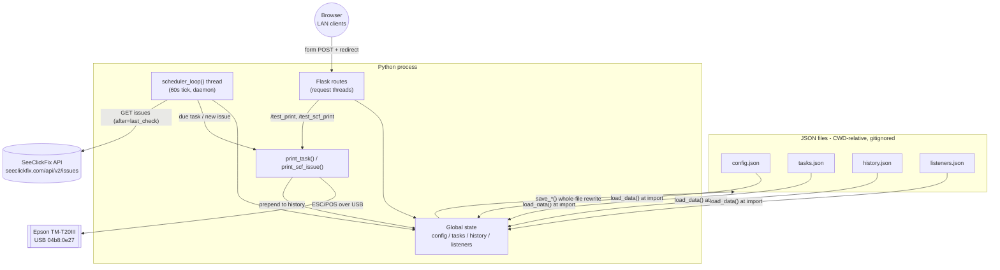

# Architecture Overview

## Process model

TaskHome is a single Python process containing:

1. **The Flask app** — serves the web UI on `0.0.0.0:5000` via Flask's built-in
   development server (`app.run`, `app.py:543`). No WSGI server, no workers, no
   reloader (debug is not enabled).
2. **The scheduler thread** — one daemon thread running `scheduler_loop()`
   forever. It is created and started at **module import time**
   (`app.py:561-563`), immediately after `load_data()`. This means importing
   `app.py` under any multi-worker or auto-reload setup would start duplicate
   schedulers and produce duplicate physical prints (see MASTER_PLAN `P0-12`).

All state is module-level global Python objects (`config`, `tasks`, `history`,
`listeners`, `app.py:32-35`) shared between the scheduler thread and Flask's
request-handler threads **without any locking** (MASTER_PLAN `P0-5`).

## Data flow

## Startup sequence (import time)

1. `load_data()` (`app.py:38-93`): reads each JSON file if present, replacing the
   in-memory defaults. Performs implicit migrations (see
   [data-model.md](data-model.md#implicit-migrations)). Any exception is logged
   and swallowed — the app will happily start with partial/default state if a
   file is corrupt.
2. Scheduler thread starts (`app.py:562-563`).
3. If run as `python app.py`, Flask's dev server starts (`app.py:566-543`).

## Scheduler thread lifecycle

`scheduler_loop()` (`app.py:303-397`) has two phases:

**Phase A — startup catch-up (runs once).** For every enabled task, while its
`next_time` (parsed naive, then force-tagged UTC via `.replace(tzinfo=timezone.utc)`)
is before `datetime.now(timezone.utc)`, advance it with `calculate_next()`.
Missed occurrences are **skipped silently, never printed**. Then `save_tasks()`.
Two significant defects live here: the naive-as-UTC comparison disagrees with the
steady-state loop's local-time comparison, and non-advancing tasks (one-off
`recurring: "none"` in the past, or `custom` with no matching days) make this
loop spin forever, killing the scheduler before it ever ticks. See
[scheduling.md](scheduling.md) and MASTER_PLAN `P0-1`/`P0-2`/`P0-3`.

**Phase B — steady state (every 60 seconds).** One big `try` per tick:

1. For each enabled task (iterating a shallow copy `tasks[:]`): if
   `next_time <= datetime.now()` (naive local), call `print_task(task)`, then
   remove the task (if `recurring == 'none'`) or advance `next_time` via
   `calculate_next`, then `save_tasks()`. Note the schedule advances **whether or
   not the print succeeded** — a disconnected printer means the occurrence is
   lost (MASTER_PLAN `P0-4`).
2. If `listeners['scf']` exists, is enabled, and has non-empty `request_types`,
   and at least `interval` minutes have elapsed since `last_check`: fetch new
   issues from the SeeClickFix API and print each one (details in
   [listeners.md](listeners.md)).
3. Sleep 60s.

Because one `try/except` wraps both steps, a single task with an unparseable
`next_time` aborts the rest of the tick — every tick — starving later tasks and
the SCF check (MASTER_PLAN `P0-6`).

## Request flow

All pages are classic server-rendered Jinja: GET renders template from global
state; POST mutates globals, calls `save_*()`, and redirects back
(Post/Redirect/Get). The two exceptions are `/test_print` and `/test_scf_print`,
which return raw HTML strings; `settings.html` calls them via `fetch()` and
sniffs the response text for the word `successful` to pick a toast
(`templates/settings.html:77-102`).

The front end depends on three CDNs (Materialize CSS/JS, Google Material Icons,
flatpickr — `templates/base.html:8-12,48-50`). Offline, selects become unusable
because the old `styles.css` hid native `<select>`s pending
Materialize's replacement (MASTER_PLAN `P0-15`).

## Printing layer

Each print opens the USB device fresh: `Usb(0x04b8, 0x0e27, profile='TM-T20II')`
— the TM-T20**II** escpos profile is used for the physical TM-T20**III**; it is
close enough to work. `is_printer_connected()` (a `usb.core.find` probe) is
checked first, then the device is opened separately — a TOCTOU window, and on
any exception mid-print the handle is never closed (MASTER_PLAN `P0-11`).
Successful prints are prepended to `history` (capped at `config['max_history']`)
and persisted. Full layouts in [printing.md](printing.md).

## What is *not* here

- No authentication, no CSRF protection, no HTTPS — trust model is "my LAN".
- No tests, no requirements.txt, no CI, no packaging.
- No print queue: prints happen inline in the scheduler tick or request thread.
- No listener abstraction: `scf` is a hardcoded `if 'scf' in listeners:` block
  inside the scheduler loop (`app.py:338`).
